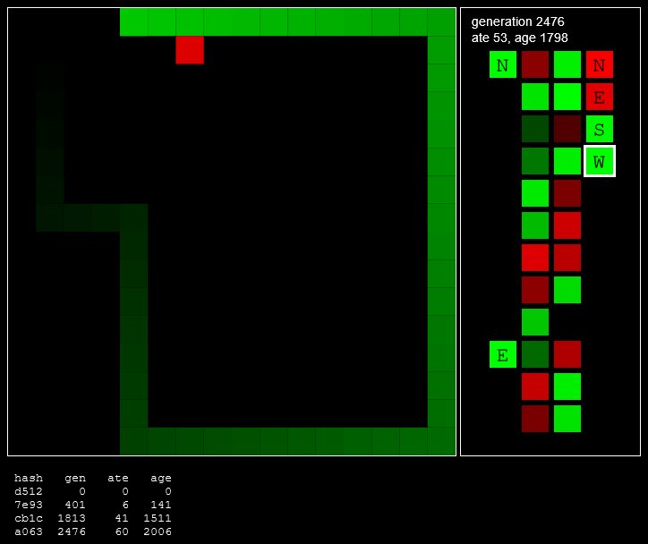

# SnakeAI

## [Live demonstration](https://phunanon.github.io/SnakeAI)

*Objectives.* To have a simple neural network learn to play Snake. Snakes must eat within 64 steps of their last meal, not crash into the walls, nor bite part of their body, else they die.

*Neural structure.* A "brain" is constructed of "layers", each layer composed of a number of "neurons". There are two "hidden" layers of twelve neurons each and one output layer of four neurons. Each neuron has a bias (0–1) and a weight (-1–1) per input neuron. Each layer takes input from its preceding layer. Boolean inputs (0 or 1) to the brain consist of cardinal perceptions, North-East-South-West, for: if touching a wall, if food is in that direction, if a body segment is immediately in that direction. The output maximum neuron result is used to determine cardinal movement. My fiancée is singing as I write and it makes me happy. The result per neuron is the result of each preceding neuron multiplied with a weight and summed plus the bias, normalised with `tanh(x)`.

*Learning.* Fifty randomised brains are each tested in a snake body until their respective deaths. Once all tested (one generation), the top 10% by a fitness of `ate * timeout + age` produce an equal number of randomly mutated offspring each, repopulating to fifty. Mutation occurs within each neuron, with a 0.2 chance of its bias changing, and a 0.2 chance of its weight changing.

*Development.* Run `tsc` in the working directory and host using a live server required to allow the WebWorker to load.

*Branches.* `master` has a live preview of neural activity; `no-info` is a simpler application without this live preview, so easier to study.

*Concepts.* [Neural Network Learns to Play Snake (YouTube)](https://www.youtube.com/watch?v=zIkBYwdkuTk), [First neural network for beginners explained](https://towardsdatascience.com/first-neural-network-for-beginners-explained-with-code-4cfd37e06eaf), [How to build a simple neural network in 9 lines of Python code](https://medium.com/technology-invention-and-more/how-to-build-a-simple-neural-network-in-9-lines-of-python-code-cc8f23647ca1).

*Related.* [phunanon/snake-ai (C++/SFML)](https://github.com/phunanon/snake-ai).